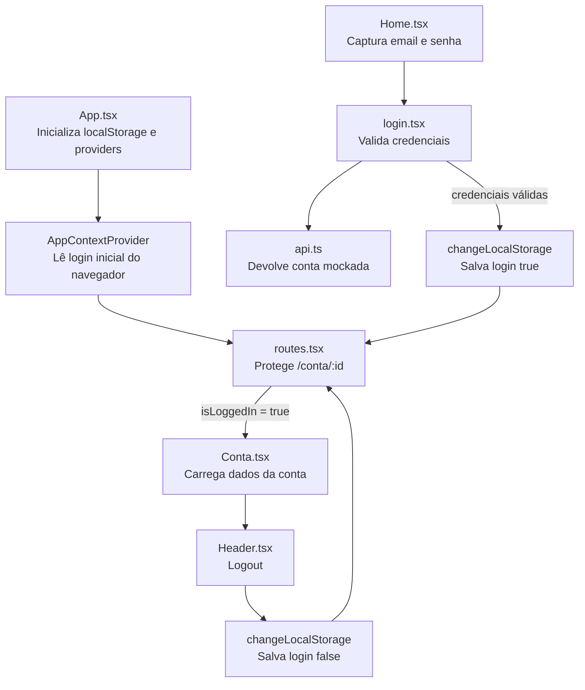

# Fluxo de Autenticação

Este arquivo resume o fluxo principal de autenticação do projeto.

## Diagrama Mermaid

## Leitura didática do fluxo

1. `App.tsx` garante a chave principal do `localStorage`.
2. `AppContextProvider` lê o login salvo e monta o estado global.
3. `Home.tsx` coleta email e senha.
4. `login.tsx` compara as credenciais com a resposta mockada de `api.ts`.
5. Em caso de sucesso, o login é salvo no contexto e no `localStorage`.
6. `routes.tsx` libera a rota `/conta/:id`.
7. `Conta.tsx` busca os dados da conta e mostra saldo e data.
8. `Header.tsx` executa logout, limpa o estado persistido e volta para a Home.

## Credenciais de teste

- Email: `test@teste.com`
- Senha: `123456`
